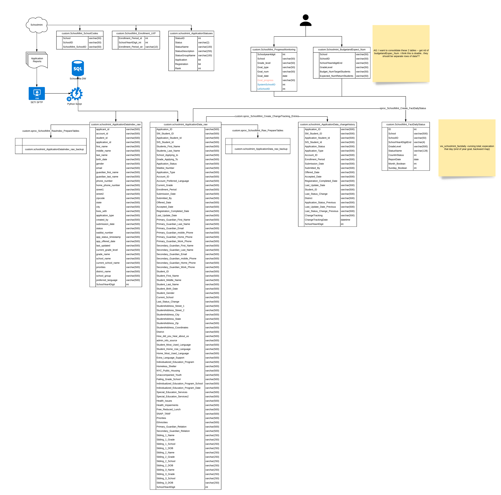

Schema
*******

Schema Setup
#############

Automatic Setup: MS SQL
~~~~~~~~~~~~~~~~~~~~~~~

To set up a locally hosted MSSQL database in Docker for development:

.. code-block:: bash

    $ docker-compose -f sql/mssql/docker-compose.yml up -d

Connect to the database in your favorite database IDE, and create your Database and Schema. Update your .env file to match.

Navigate to the main project folder, and create the database objects automatically in the database:

.. code-block:: bash

    $ docker build -t schoolmint .
    $ docker run -it --network host schoolmint --mssql

Automatic Setup: PostgreSQL
~~~~~~~~~~~~~~~~~~~~~~~

To set up a locally hosted PostgreSQL database in Docker for development:

.. code-block:: bash

    $ docker-compose -f sql/postgres/docker-compose.yml up -d

Connect to the database in your favorite database IDE, and create your Database and Schema. Update your .env file to match.

Navigate to the main project folder, and create the database objects automatically in the database:

.. code-block:: bash

    $ docker build -t schoolmint .
    $ docker run -it --network host schoolmint --postgres

After the code is finished running, you should have the following tables, views, and sprocs:

Tables
~~~~~~~

* schoolmint_ApplicationData_changehistory
* schoolmint_ApplicationData_raw
* schoolmint_ApplicationData_raw_backup
* schoolmint_ApplicationDataIndex_raw
* schoolmint_ApplicationDataIndex_raw_backup
* schoolmint_ApplicationStatuses
* schoolmint_FactDailyStatus
* schoolmint_lk_Enrollment
* schoolmint_Progressmonitoring
* schoolmint_SchoolCodes

Views
~~~~~~
* vw_schoolmint_AppStatusList
* vw_schoolmint_FactDailyStatus_InterimTargets
* vw_schoolmint_FactDailyStatus
* vw_schoolmint_FactProgressMonitoring
* vw_schoolmint_Index_Demographics
* vw_schoolmint_ProgressMonitoring

Stored Procedures
~~~~~~~~~~~~~~~~~~

* sproc_schoolmint_Create_ChangeTracking_Entries
* sproc_schoolmint_Create_FactDailyStatus
* sproc_schoolmint_Index_PrepareTables
* sproc_schoolmint_Index_PostProcess
* sproc_schoolmint_Raw_PrepareTables
* sproc_schoolmint_Raw_PostProcess

Lookup Tables
##############

The following lookup tables need to be populated:

1. **schoolmint_lk_Enrollment**: Load the data from sql/data/lk_enrollment.csv into this table.
2. **schoolmint_Progressmonitoring**: Refer to the template sql/data/progress_monitoring.csv for an example.

   * **Budget_NumTargetStudents** (required): The expected number of students in seats on our Finance's Census day, by grade level and school (as set by our finance team in conversation with SLs; we use 9/20 as our finance census date, but could differ by Region). 
   * **Expected_NumReturnStudents** (required): The expected number of students returning each year, by grade-level and school. 
   * **App 1 - App Final** (optional): Interim goals for number of applications submitted in SchoolMint.
   * **Reg 1 - Reg Final** (optional): Interim goals for number of applications in "registration complete" and "registration verified" status. 

3. **schoolmint_ApplicationStatuses**: Load the data from sql/data/application_statuses.csv into this table.
4. **schoolmint_SchoolCodes**: Load with the school ID mapping that you received from SchoolMint support. Refer to sql/data/school_codes.csv for an example.

Final ERD
##########

`View ERD on LucidChart <https://www.lucidchart.com/invitations/accept/47fd9583-9736-4174-983a-ec526ec2851c>`_

Tables & Processes
####################

(click image to view larger)

Views
#######

(click image to view larger)

.. image:: _static/schoolmint_schema_views.png
    :target: _static/schoolmint_schema_views.png
